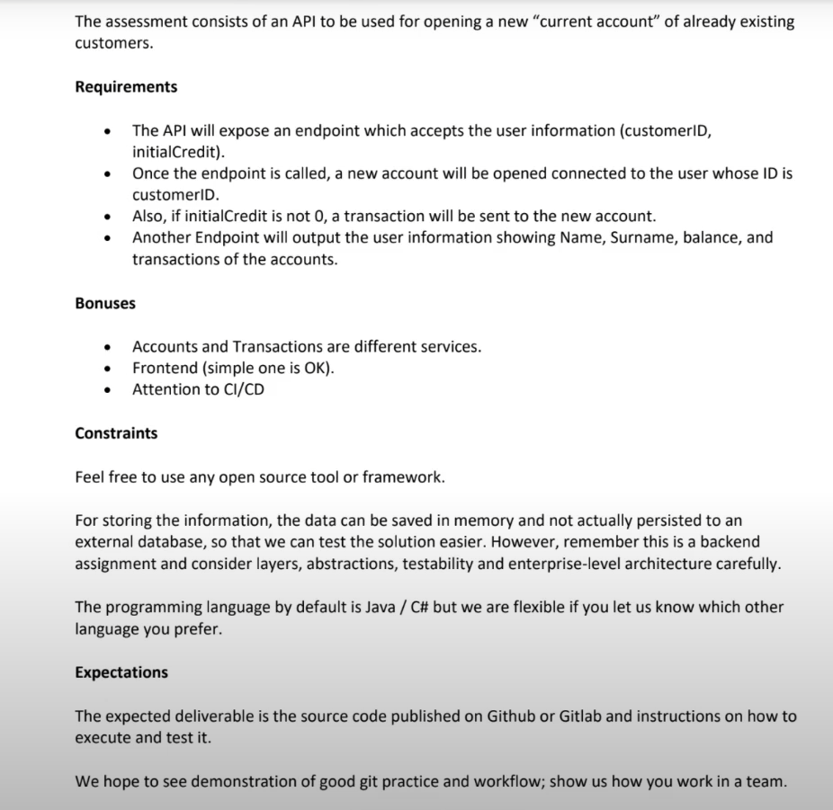

# Bank Account Management Application

This project is a **Spring Boot** application designed to manage customer accounts and transactions. The application allows you to perform operations such as creating accounts, retrieving customer information, and managing transactions associated with accounts. The application uses a layered architecture with DTOs for data transfer and follows best practices in software development.

## Project Structure

The project is structured into several packages, each responsible for different aspects of the application:

- **controller**: Contains the REST controllers that handle incoming HTTP requests.
  - `AccountController`: Manages account-related operations.
  - `CustomerController`: Manages customer-related operations.

- **dto**: Contains Data Transfer Objects (DTOs) and converters used to transform entities into DTOs and vice versa.
  - `AccountDto`, `CreateAccountRequest`, `CustomerDto`, `TransactionDto`: DTO classes for data transfer.
  - `AccountDtoConverter`, `CustomerDtoConverter`, etc.: Converters to map entities to DTOs.

- **exception**: Contains custom exceptions and the global exception handler.
  - `CustomerNotFoundException`: Thrown when a requested customer is not found.
  - `GlobalExceptionHandler`: Handles exceptions globally and provides meaningful error responses.

- **model**: Contains the core business entities.
  - `Account`: Represents a bank account entity.
  - `Customer`: Represents a customer entity.
  - `Transaction`: Represents a transaction entity.
  - `TransactionType`: Enum for transaction types (INITIAL, TRANSFER).

- **repository**: Contains interfaces for data persistence.
  - `AccountRepository`, `CustomerRepository`, `TransactionRepository`: Interfaces for CRUD operations on entities.

- **service**: Contains the business logic of the application.
  - `AccountService`, `CustomerService`: Services for handling business operations on accounts and customers.
  
- **resources**:
  - `static`: Contains static resources.
  - `templates`: Contains template files (e.g., HTML templates for email or web pages).
  - `application.properties`: Configuration file for Spring Boot application.

## The application has 2 apis
- `POST /v1/account - creates a new account for existing customer`
- `GET /v1/customer/{customerId} - retrieves a customer`
- `GET /v1/customer - retrieves all customers`


## Features

- **Customer Management**: Create, retrieve, and manage customers.
- **Account Management**: Create accounts associated with customers, manage account balances, and perform transactions.
- **Transaction Management**: Record and manage transactions related to accounts.

## Getting Started

### Prerequisites

- **Java 17** or later
- **Maven 3.8+**
- **Kotlin**
- **Restful API**
- **OpenAPI documentation**
- **H2 In memory database**
- **Docker**
- **Docker compose**
- **JUnit 5**
- **ReactJS for frontend**

### Running the Application

1. **Clone the repository**:
   ```bash
   git clone https://github.com/btbatux/BankAccount.git
   cd BankAccount

2. **Docker Compose**:
For docker compose usage, docker images already push to docker.io
You just need to run -`Docker-compose up` command

3. **Maven**
For maven usage, you need to change `proxy` value in the `account-fe/package.json` file by `"http://localhost:8080"` due to the default value has been settled for docker image network proxy.

$PORT: 8080

- ` $ cd account/account-api`
- ` $ mvn clean install`
- ` $ mvn spring-boot:run`

- `$ cd account/account-fe`
- `$ npm install`
- `$ npm start`


**Swagger UI will be run on this url**

- `http://localhost:${PORT}/swagger-ui.html`
